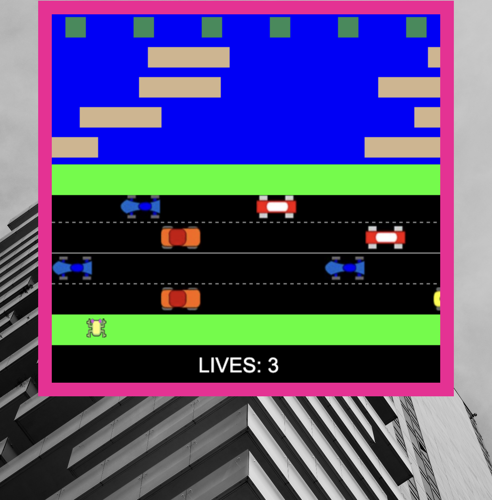

# **Microbes**

## **Game History**

>Frogger is a 1981 arcade action game developed by Konami and manufactured by Sega.[5] In North America, it was released by Sega/Gremlin. The object of the game is to direct a series of frogs to their homes by crossing a busy road and a hazardous river.

## **Motivation**

### This project was intended as an adaptation of Frogger retitled: "**Microbes**":

>The "bugs" were supposed to crawl across someone's face and the objective was to direct your Microbe towards the giant nose at the top of the board. Once you got there, a gif of someone sneezing would play.

## **Images**

## **Tech Stack**

- JS
- HTML
- CSS
- ELBOW GREASE (v.14)

## **Upcoming Features**

- I have to change the sprites.
- Link a gif
- create a space bar stop effect
- add sound f/x
- the background will be changed to a persons face
- I will fix the lilly pads
- The 'win' function had a breakdown I have no idea    how to fix it.
